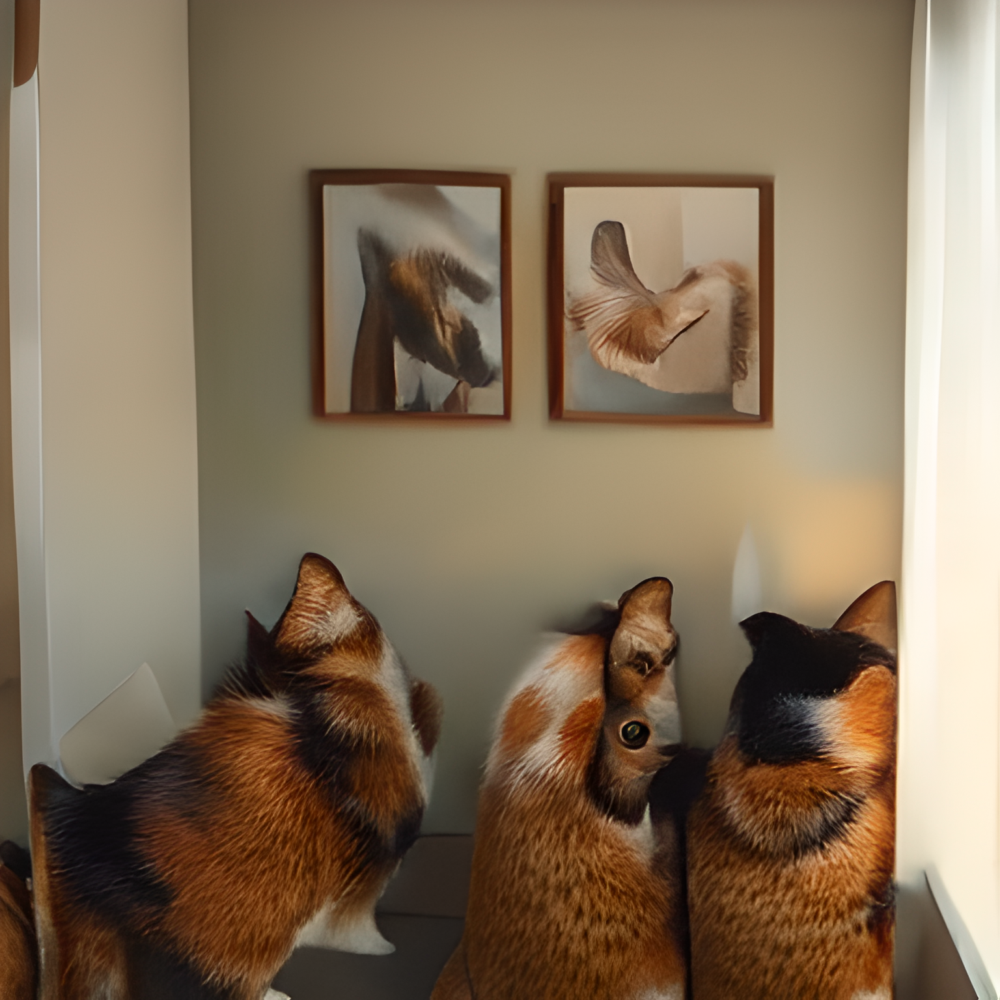

# Cat-Friendly Room Generation with DeepSeek Janus Pro & Real-ESRGAN

This repository contains a project that utilizes **DeepSeek Janus Pro** for text-to-image generation and **Real-ESRGAN** for super-resolution upscaling. The goal is to generate and enhance realistic cat-friendly environments based on descriptive prompts.

## Features
- **Image Generation**: Uses [DeepSeek Janus Pro](https://github.com/deepseek-ai/Janus) to generate cat-friendly room environments based on detailed prompts.
- **Image Upscaling**: Leverages [Real-ESRGAN](https://github.com/xinntao/Real-ESRGAN/tree/master) to enhance image quality for better visual fidelity.
- **Customizable Inputs**: Users can define room attributes like lighting, furniture, and interactive cat elements.

## Installation
### Clone the repository
```bash
git clone https://github.com/UlianaDzhumok/deepseek_janus_pro_experiments.git
cd deepseek_janus_pro_experiments
```

### Install Dependencies
All dependencies installation place in the beggining of the notebook

## Usage
### Multimodal understanding
Define `image` and `question` in the script and run:
```python
# Load the image
image = Image.open("./frame_0.jpg")

# Define inputs
question = "How many cats do you see in the photo? Describe their appearance and behaviour."

seed = 42
top_p = 0.8
temperature = 0.5

# Call the function with the correct image format
multimodal_understanding([image], question, seed, top_p, temperature)
```

#### Example Output
> "I see two cats in the photo. One cat is white and is standing near the wooden shelf on the left side of the image. 
The other cat is mostly white with some black markings and is sitting on the floor near the center of the image. 
Both cats appear to be calmly observing their surroundings."


### Generating an Image
Modify `refined_prompt` in the script and run:
```python
from generate_image import generate_image

generated_images = generate_image(
    prompt="Describe the cat-friendly room",
    seed=4937,
    guidance=11,
    t2i_temperature=0.8
)
```

#### Upscaling an Image
After generating an image, apply Real-ESRGAN upscaling:
```python
from upsample import image_upsample

upscaled_image = image_upsample(generated_images[0])
upscaled_image.show()
```

#### Example Output
#### Input Prompt
> "A cozy and inviting room for cats with soft furniture, natural lighting, interactive toys, and climbing structures."

#### Upscaled Generated Image


## References
- [DeepSeek Janus Pro](https://github.com/deepseek-ai/Janus)
- [Real-ESRGAN](https://github.com/xinntao/Real-ESRGAN/tree/master)

## License
This project is open-source and available under the MIT License.